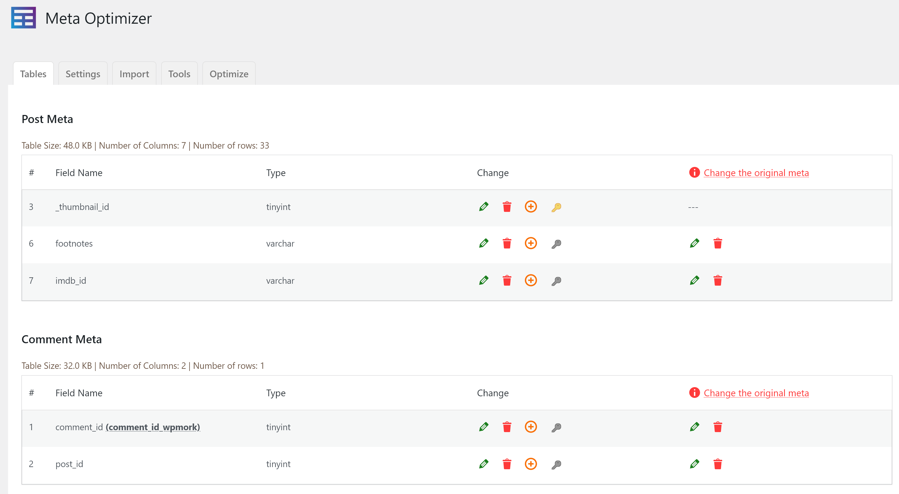
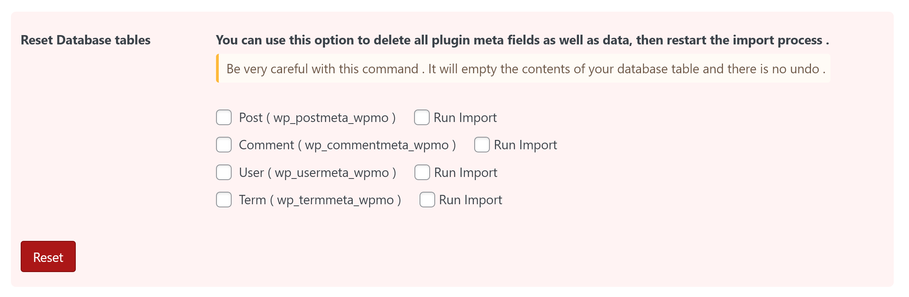
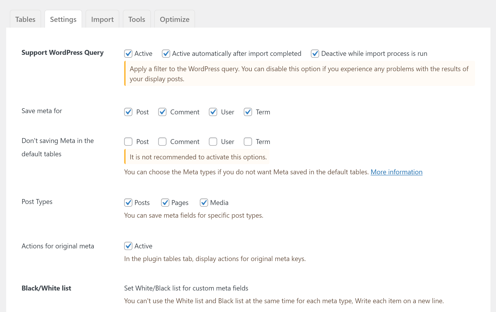

# Meta Optimizer

Meta Optimizer ([Download stable version from WordPress.org](https://wordpress.org/plugins/meta-optimizer/)) a WordPress plugin that helps your website load faster if you use more meta like Post / Comment / User / Term metas!

 
## How to plugin works
WordPress saves every post / comment / user / term meta in new row.
with this plugin, you can save all of them to single row, and each column will be a meta key.


Plugin work with default WordPress functions and support all plugins use WordPress standard functions and hooks.

 
## Features
- Create database tables for each of WordPress meta tables (Post / Comment / User / Meta).
- Support WordPress Queries
- Faster Queries & Easy Export
- Import old data from default WordPress meta table
- Bypass core meta tables for specific fields
- Export all the data easier by exporting only one table

 
## Integration
- [Advanced Custom Fields](https://wordpress.org/plugins/advanced-custom-fields/) and Pro version
- [Meta Box – WordPress Custom Fields Framework](https://wordpress.org/plugins/meta-box/) and Pro version
- [CMB2](https://wordpress.org/plugins/cmb2/)
- And all the plugins and themes use WordPress standard functions.

 
## Screenshots

### Tables tab, You can manage meta table columns


### Settings tab, Plugin options


### Import tab, Import options


 
## Plugin Hooks
### Change import items number
```
add_filter( 'wpmetaoptimizer/import_items_number', function ( $importItemsNumber ) {
    // return numeric value
    return $importItemsNumber + 20;
} );
```

 
## Attention
If you use reserved column keys such as `post_id` for post meta, the plugin adds a suffix to the meta key. It creates a column based on the renamed key. As an example, if you save meta with key `post_id`, then plugin adds `_wpmork` suffix and creates column `post_id_wpmork`. In response to a query (WP_Query), the plugin automatically changes the meta key if necessary.

 

[Update post meta](https://developer.wordpress.org/reference/functions/update_post_meta/) example 
```
update_post_meta(1, 'post_id', 222);
```
The meta key has been changed to:
```
update_post_meta(1, 'post_id_wpmork', 222);
```

 

Example [Query](https://developer.wordpress.org/reference/classes/wp_query/#custom-field-post-meta-parameters):
```
$query = new WP_Query(array(
    'orderby' => array(
        'post_id' => 'DESC'
    ),
    'meta_query' => array(
        'post_id' => array(
            'key' => 'post_id',
            'compare' => 'EXISTS',
            'type' => 'NUMERIC'
        )
    )
));
```
Plugin changed a query to this:
```
$query = new WP_Query(array(
    'orderby' => array(
        'post_id_wpmork' => 'DESC'
    ),
    'meta_query' => array(
        'post_id_wpmork' => array(
            'key' => 'post_id_wpmork',
            'compare' => 'EXISTS',
            'type' => 'NUMERIC'
        )
    )
));
```

 

## Frequently Asked Questions

**What type of meta types supported?**

*Meta Optimizer can save default WordPress meta types like Post / User / Comment / Term.*

**Can I use this plugin for custom post types?**

*Yes, of course. Even though the plugin supports the built-in types of post and page, it is well suited to storing meta data for custom post types.*

**Can I rename meta key in DB tables?**

*Yes, You can rename meta key in default WP tables and plugin tables.*

 

## Changelog
### 1.2.2
* Fix save array when insert new meta row

### 1.2.1
* NumericVal meta value & change field type when create db table field

### 1.2
* Fix bugs effected on save meta array value
* Improve the import process

### 1.1
* Fix bugs effected on save meta array value

### 1.0
* Release a first version of plugin
* Support get/add/update/delete meta functions and WordPress queries

 

## Unit Test
Currently, unit tests are limited to checking database tables and can't check plugin functionality! If you are able to help write tests for the plugin, please submit a pull request. Thank you :) 

1. [Initialize the testing environment locally](https://make.wordpress.org/cli/handbook/misc/plugin-unit-tests/#3-initialize-the-testing-environment-locally)
2. Install Dependency: `composer install`
3. Run Test: Windows `./vendor/bin/phpunit` / Unix: `vendor/bin/phpunit` or `phpunit`

 

## Production plugin
For create production plugin, run this command in plugin directory:

Unix: `bin/create-plugin.sh`
Windows: `.\bin\create-plugin.sh`

 

### Documents
[Documents page](https://parsakafi.github.io/wp-meta-optimizer/)
